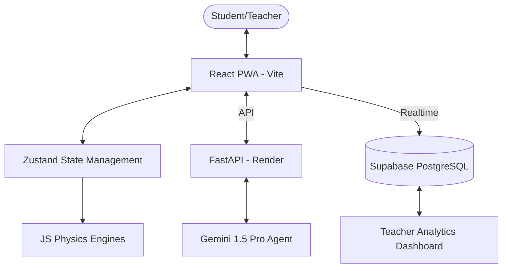
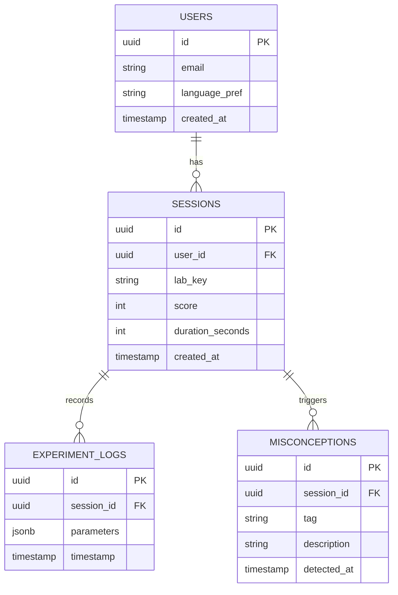
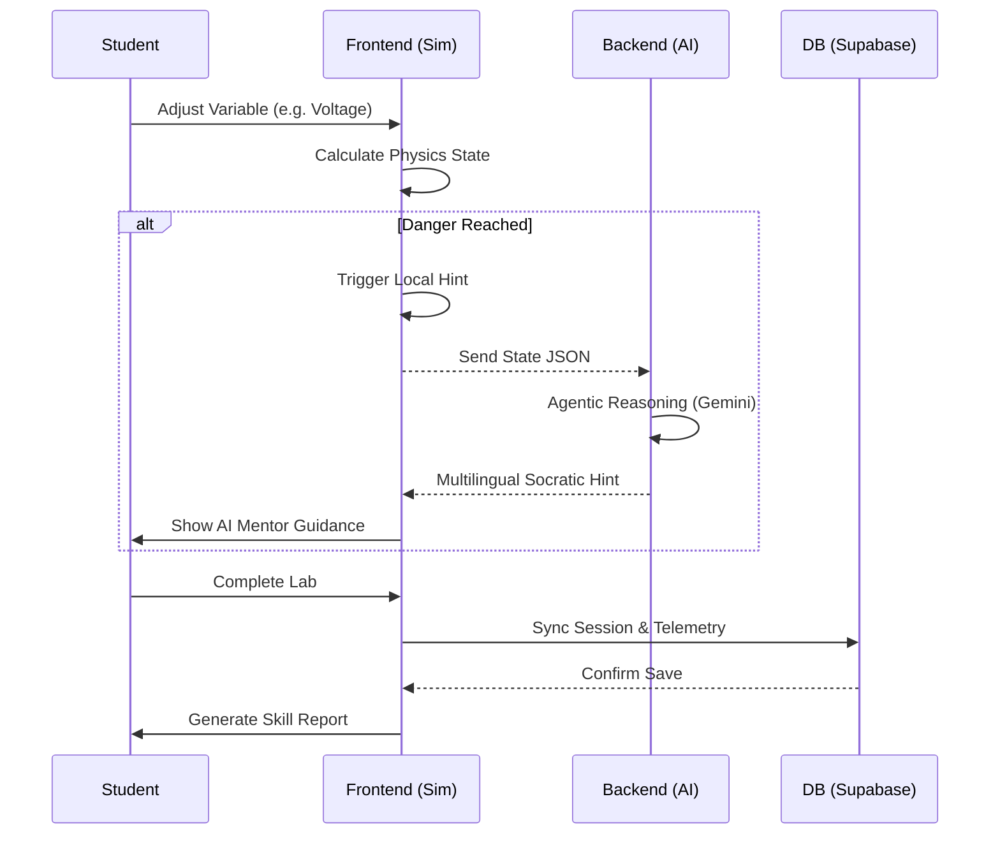

# VirtuLab.ai

Democratizing Practical STEM Education Through Interactive, Offline-First Virtual Laboratories.

---

## 🛠️ VirtuLab Tech Stack

### Problem Title
The Practical Education Divide: Unequal Access to Laboratory Infrastructure in Indian Higher Education.

### Problem Description
India’s National Education Policy (NEP 2020) emphasizes experiential learning. However, practical infrastructure remains deeply unequal. Students at premier institutions access advanced laboratories, while many students in rural or under-resourced colleges rely solely on textbooks. Science and engineering education require hands-on experimentation, without which theoretical learning lacks intuition and application.

### Target Users
- Undergraduate students (B.Tech First Year) requiring lab intuition.
- Class 11-12 Science students preparing for practical exams.
- Educational institutions with limited physical lab infrastructure.
- Self-learners in remote areas with low-bandwidth internet.

### Existing Gaps
- **Infrastructure Barrier:** High cost of procuring and maintaining physical labs.
- **Access Inequality:** Geographic and economic divide in institutional facilities.
- **Static Learning:** Most simulators are passive and do not provide real-time guidance during errors.
- **Resource Constraints:** Heavy software often fails in low-connectivity rural environments.

---

## 🔄 Workflow Diagram

### Root Cause Analysis
Physics and Chemistry experiments require expensive chemicals, delicate equipment, and constant supervision. In many colleges, labs exist only on paper, or students are forced to copy observations from manuals without ever touching the equipment. This creates a "theory-only" graduate pool.

### Solution Strategy
We approach this by building a "Lab in the Pocket":
1. **Digital Simulation:** Mathematical science engines that calculate precisely like real physics but cost zero in chemicals.
2. **Offline-First PWA:** Ensuring the code runs on any budget smartphone without requiring constant high-speed internet.
3. **AI Observability:** Integrating a Language Model that "sees" the student's experimental state to provide Socratic guidance rather than just answers.

---

## 3. Proposed Solution

### Solution Overview
VirtuLab.ai is an intelligent ecosystem designed for B.Tech and Class 11-12 curriculum. It provides physically accurate, risk-free virtual experiments, bridging institutional inequity through scalable simulation technology.

### Core Idea
To transform abstract formulas into observable, interactive phenomena. We combine real-time computational physics with a "Mentor-in-the-Loop" AI system that monitors user interactions to prevent accidents and guide learning.

### Key Features
- **Physically Accurate Simulators:** Ohm's Law, Projectile Motion, Titration, Flame Test, and Periodic Table Trends.
- **Socratic AI Tutor:** An intelligent sidebar that provides hints and asks guiding questions when a student struggles or makes a dangerous error.
- **Manual Input Control:** Precise numeric input for variables (Voltage, Angle, Concentration) to ensure scientific accuracy.
- **Auto-Generated Lab Reports:** Instant PDF-style summaries of Aim, Procedure, and Results based on the student's actual performance.
- **Teacher Telemetry:** Real-time dashboard showing class-wide misconceptions (e.g., "50% of students are blowing the fuse in the circuit lab").

---

## 4. System Architecture

### High-Level Flow
**User** → **Frontend** (React/Vite) → **Backend** (FastAPI) → **Model** (Gemini 1.5 Pro) → **Database** (Supabase) → **Response** (Socratic Hint)

### Architecture Description
VirtuLab follows a strictly decoupled architecture. The **Frontend** handles the heavy lifting of physics calculations and UI rendering. **Zustand** manages the global lab state. When the student makes a decision, the state is synced to the **FastAPI Backend**, which uses **LangGraph** to process Socratic reasoning through the **Gemini API**. All telemetry is stored in **Supabase** for real-time dashboard updates.

### Architecture Diagram

---

## 5. Database Design

### ER Diagram

### ER Diagram Description
- **Users:** Stores student profiles and IDs.
- **Sessions:** Records every lab attempt including duration and final score.
- **Misconceptions:** Tracks specific failure triggers (e.g., "Short Circuit", "Over-titration") to map pedagogical gaps.
- **Experiment Logs:** Granular time-series data of parameter changes for telemetry.

---

## 6. Dataset Selected

### Dataset Name
Physical Constants & Procedural Handbooks.

### Source
NCERT, AICTE Guidelines, and NIST Physical Reference Data.

### Data Type
Structured JSON/Tabular data for atomic properties, chemical reactions, and physics constants.

### Selection Reason
Simulations require absolute physical accuracy. By using verified constants (Atomic Mass, Ionization Energy, Gravity Constants), we ensure our virtual world mirrors the real world perfectly.

### Preprocessing Steps
- Standardizing units (MKS System).
- Mapping atomic data for all 118 elements into a fast-loading JSON structure.
- Normalizing failure thresholds (e.g., what current causes a 'fuse' to blow).

---

## 7. Model Selected

### Model Name
**Google Gemini 1.5 Pro**

### Selection Reasoning
Exceptional reasoning capabilities for scientific context and a large context window to process complex JSON simulation states. It natively supports multilingual responses (Hindi, Tamil, etc.), which is critical for our target rural demographics.

### Alternatives Considered
- **GPT-4o:** Powerful but higher latency and cost for this specific edge-case.
- **Llama 3 (Local):** Great for privacy, but too heavy for the target low-end mobile devices.

### Evaluation Metrics
- **Pedagogical Accuracy pulse:** Socratic Compliance (Asking vs. Telling).
- **Latency:** Prompt-to-hint response time < 2 seconds.

---

## 8. Technology Stack

### Frontend
- **React 18** & **Vite** (Build Tool)
- **Tailwind CSS** (Styling)
- **Framer Motion** (Animations)
- **Zustand** (State Management)
- **Lucide React** (Icons)

### Backend
- **FastAPI** (Python)
- **Uvicorn** (ASGI Server)
- **Pydantic** (Data Validation)

### ML/AI
- **Google Generative AI SDK** (Gemini 1.5 Pro)
- **LangChain/LangGraph** (Agentic Flow)

### Database
- **Supabase** (PostgreSQL + Real-time)

### Deployment
- **Vercel** (Frontend)
- **Render** (Backend)

---

## 9. API Documentation & Testing

### API Endpoints List
- **GET `/api/health`**: Check system status.
- **GET `/api/simulations`**: Retrieve all lab metadata.
- **POST `/api/tutor/analyze`**: Submit simulation state to the AI mentor.
- **GET `/api/teacher/heatmap`**: Fetch class-wide error analytics.

### API Testing Screenshots
*(Add Postman screenshots showing JSON response from Gemini)*

---

## 10. Module-wise Development & Deliverables

### Checkpoint 1: Research & Planning
- Deliverables: Mathematical models for Pendulums, Circuits, and Titration.

### Checkpoint 2: Backend Development
- Deliverables: FastAPI core structure, Gemini API integration, and Supabase Schema.

### Checkpoint 3: Frontend Development
- Deliverables: Simulation Canvas, Sidebar Controls, and PWA configuration.

### Checkpoint 4: Model Training / Prompting
- Deliverables: Socratic Prompt Engineering and failure state mapping.

### Checkpoint 5: Model Integration
- Deliverables: Real-time syncing between UI triggers and AI hints.

### Checkpoint 6: Deployment
- Deliverables: Vercel/Render hosting and SSL configuration.

---

## 11. End-to-End Workflow

1. Student logs in to **VirtuLab.ai**.
2. Selects an experiment (e.g., Ohm's Law).
3. Adjusts parameters (Voltage/Resistance) via tactile sliders.
4. If parameters reach a "Danger Zone," the **AI Mentor** triggers a Socratic hint.
5. Student completes the experiment and clicks **Generate Report**.
6. System calculates **Procedural Accuracy** and **Concept Mastery**.
7. Data is pushed to the **Teacher Dashboard** for classroom monitoring.

---

## 12. Demo & Video

- **Live Demo Link:** [virtu-lab-sage.vercel.app](https://virtu-lab-sage.vercel.app/)
- **Demo Video Link:** [Google Drive Video](https://drive.google.com/file/d/1WVGDHDW2Dqyi93VpKWGE0cIJVBEU9VyA/view)
- **GitHub Repository:** [VirtuLab GitHub](https://github.com/Gautam-Bharadwaj/VirtuLab)

---

## 13. Hackathon Deliverables Summary

- Fully functional **VirtuLab.ai** platform.
- Integrated **AI Socratic Tutor**.
- **9+ Simulation Modules** (Physics, Chem, Bio).
- **Teacher Telemetry Dashboard**.
- Offline-ready **PWA** distribution.

---

## 14. Team Roles & Responsibilities

| Member Name | Role | Responsibilities |
|-------------|------|-----------------|
| **Kumar Gautam** | **Project Lead & Frontend Architect** | Core UI/UX, Simulation Logic, State Management (Zustand). |
| **Mohit** | **Backend & AI Engineer** | FastAPI development, LangGraph orchestration, Gemini integration. |
| **Karan Thakur** | **Database & Infrastructure** | Supabase setup, Real-time telemetry, Deployment. |

---

## 15. Future Scope & Scalability

### Short-Term
- Adding 20+ more experiments for Mechanical Engineering.
- Implementing vernacular language voice-overs for the AI tutor.

### Long-Term
- **Augmented Reality (AR):** Visualizing atomic structures in 3D using mobile cameras.
- **Institutional API:** Direct integration with University LMS platforms.

---

## 16. Known Limitations

- **Internet Dependency for AI:** Advanced Socratic generation requires active internet (Local JSON fallback exists for basic offline hints).
- **Ideal Models:** Currently assumes ideal conditions (zero wire resistance, pure chemicals).
- **Mobile Browsers:** Best experienced on Chrome/Safari; others may have canvas rendering lag on very old devices.

---

## 17. Impact

- Bridge the gap for **50,000+ students** in rural colleges.
- Reduce institutional laboratory costs by **up to 70%**.
- Future-proof STEM education by making it "learning by doing" rather than "learning by copying."
