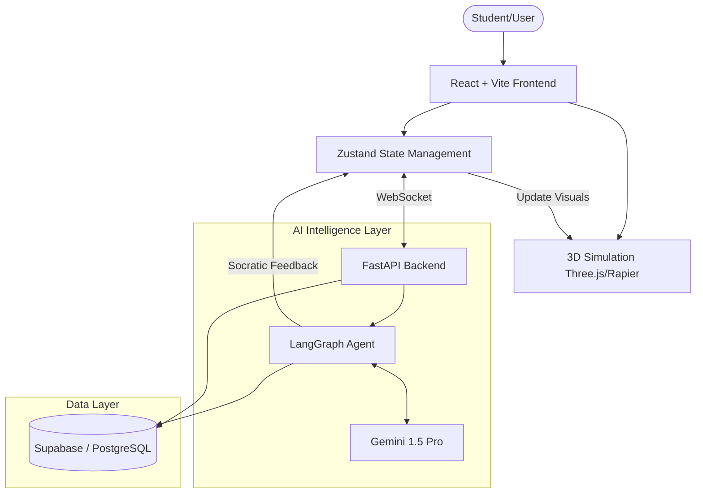

# VirtuLab

VirtuLab is a modern virtual science lab that brings together high-quality 3D simulations and real-time AI guidance. Our goal is to make science experiments interactive, safe, and deeply educational through technology.

---

## Technical Stack

### Frontend Experience
The interface is built to be fast and responsive, providing a smooth experience for users.
- **Framework**: We use React with Vite to ensure our application loads quickly and stays performant.
- **3D Graphics**: Three.js and React Three Fiber power our immersive lab environments.
- **Physics**: Real-time scientific calculations, such as Faraday's Law, are handled by the Rapier physics engine.
- **State Control**: Zustand manages the critical variables like voltage and mass while keeping the AI chat in sync.
- **Design**: Tailwind CSS helps us create a modern, clean look with intuitive glassmorphism effects.
- **Hosting**: The frontend is deployed and served through Vercel.

### Backend Intelligence
The backend serves as the brain of the platform, handling complex logic and AI interactions.
- **API and Scaling**: FastAPI manages our data flow and keeps WebSocket connections stable and fast.
- **AI Orchestration**: We use LangGraph to design the logic of our AI mentor, helping it understand where students feel stuck.
- **Core AI**: Gemini 1.5 Pro provides the reasoning behind our AI mentor's feedback and conversations.
- **Data Management**: Supabase stores essential information like student logs and progress analytics for teachers.
- **Hosting**: The backend infrastructure is hosted on Railway.

---

## System Workflow



---

## Project Organization

The repository is organized into two main parts: the interactive frontend and the intelligent backend.

```text
virtu-lab/
├── virtu-lab-frontend/        # All client-side code and UI components
│   ├── src/
│   │   ├── components/        # Controls, 3D elements, and chat interface
│   │   ├── store/             # Global state for experiment variables
│   │   ├── hooks/             # Logic for server-side communication
│   │   └── pages/             # View for both students and teachers
│   └── vite.config.js
│
└── virtu-lab-backend/         # Server-side logic and AI integration
    ├── main.py                # Core server and connection logic
    ├── agent.py               # AI workflow and interaction logic
    ├── database.py            # External service and database connections
    └── requirements.txt       # Necessary Python packages
```
